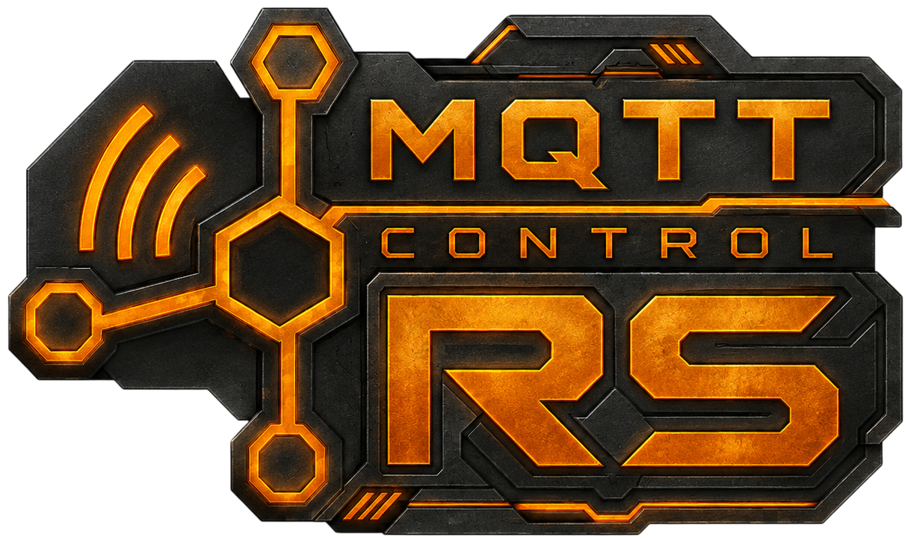

  

  <a href="#русский">Русский</a> ·
  <a href="#english">English</a>

## Русский

### MQTT Control RS — релизы

Готовые установочные пакеты MQTT Control RS для Windows, Debian/Ubuntu,
Fedora и Arch Linux.

#### Последняя версия

Скачать актуальные пакеты можно из каталога [`latest`](latest/).

Архив предыдущих версий находится в каталоге [`versions`](versions/).

---

## English

### MQTT Control RS — Releases

Prebuilt MQTT Control RS installation packages for Windows, Debian/Ubuntu,
Fedora, and Arch Linux.

#### Latest release

Download the current installation packages from the [`latest`](latest/) directory.

Previous releases are available in the [`versions`](versions/) directory.
